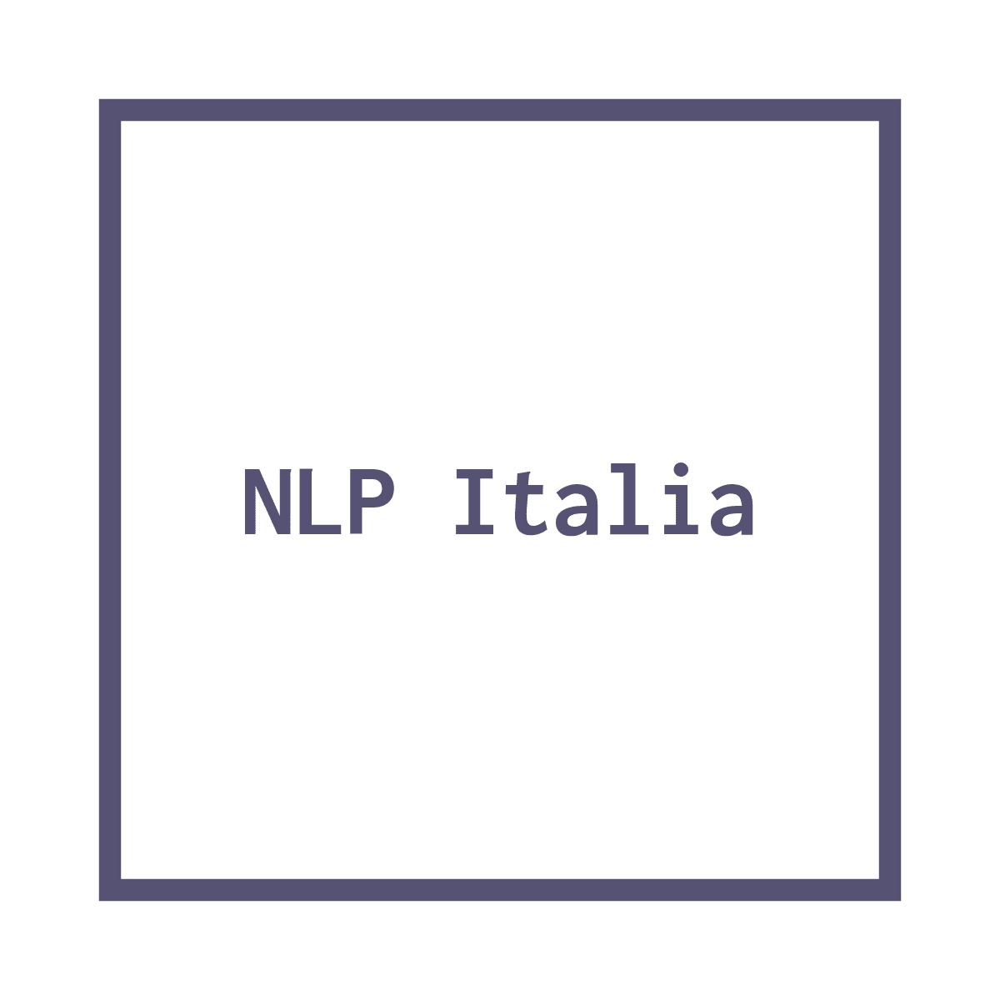

# nlpitalia
A collection of NLP resources for Italian. Do you want to add a new resource? Ping me at me@angelobasile.it

## Corpora

### Large unannotated corpora

- [PAISÀ](https://www.corpusitaliano.it/)
- [itWaC](http://wacky.sslmit.unibo.it/doku.php?id=corpora)

### Sentiment-analysis

- [TWITA](http://valeriobasile.github.io/twita/downloads.html)

## Toolkits

- [Tint](http://tint.fbk.eu/)
  > Tint (The Italian NLP Tool) is a Java-based pipeline for Natural Language Processing (NLP) in Italian. It is very fast and accurate, and implements most of the common linguistic tools, such as part-of-speech tagging and dependency parsing. The tool is based on Stanford CoreNLP, and can be used as a stand-alone tool, included as a Java library or as a REST API service. Tint also includes wrappers (for third-party tools) that use the CoreNLP paradigm and therefore can be applied to languages different than Italian.

## Morphological dictionaries

- [Morphit](https://github.com/giodegas/morphit-lemmatizer)

## Word Embeddings

- [Italian Word Embeddings](http://hlt.isti.cnr.it/wordembeddings/)
