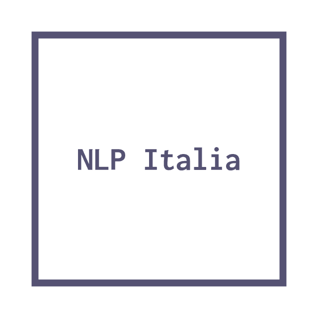

# nlpitalia
A collection of NLP resources for Italian. Do you want to add a new resource? Ping me at [me chiocciola angelo basile punto it] or start a new issue using the `New resource` template.

## Corpora

### Large corpora

- [PAISÀ](https://www.corpusitaliano.it/)
- [itWaC](http://wacky.sslmit.unibo.it/doku.php?id=corpora)

### Sentiment analysis

- [TWITA](http://valeriobasile.github.io/twita/downloads.html)

## Toolkits

- [Tint](http://tint.fbk.eu/)
  - description:
    > Tint (The Italian NLP Tool) is a Java-based pipeline for Natural Language Processing (NLP) in Italian. It is very fast and accurate, and implements most of the common linguistic tools, such as part-of-speech tagging and dependency parsing. The tool is based on Stanford CoreNLP, and can be used as a stand-alone tool, included as a Java library or as a REST API service. Tint also includes wrappers (for third-party tools) that use the CoreNLP paradigm and therefore can be applied to languages different than Italian.(Source: http://tint.fbk.eu/)
  - [reference](http://arxiv.org/abs/1609.06204)

## Morphological dictionaries

- [Morphit](https://github.com/giodegas/morphit-lemmatizer)

## Word Embeddings

|   | name                                                                                                                            | source            | size | vocabulary | link                                   | file size |
|---|---------------------------------------------------------------------------------------------------------------------------------|-------------------|------|------------|----------------------------------------|-----------|
| 1 | [Italian Word Embeddings - skipgram](http://hlt.isti.cnr.it/wordembeddings/skipgram_wiki_window10_size300_neg-samples10.tar.gz) | Italian Wikipedia | ?    | ?          | http://hlt.isti.cnr.it/wordembeddings/ | 1.5GB     |
| 2 | [Italian Word Embeddings - Glove](http://hlt.isti.cnr.it/wordembeddings/glove_wiki_window10_size300_iteration50.tar.gz)         | Italian Wikipedia | ?    | ?          | http://hlt.isti.cnr.it/wordembeddings/ | 790MB     |
|   |                                                                                                                                 |                   |      |            |                                        |           |
